
## Requirements for Group Project
[Read the instruction](https://github.com/STIW3054-A231/class-activity-stiw3054/blob/main/GroupProject.md)
## Group Info

## Title of your application (Capybara App)
## Abstract (in 300 words)
   1. Background  
   Issue tracking is a critical practice for software teams to manage tasks, bugs, and features. Real-time visibility into issue tracking helps teams collaborate and prioritize more effectively by providing instantaneous data and insights.   
   2. Problem Statement (from articles or newspaper or social media)  
   Traditional issue tracking systems lack real-time streaming of data and rely on outdated batch processing models. This leads to delays and stale views of issue tracking activity as teams must wait for data to be processed in batches.   
   3. Main objective  
   This project aims to develop an end-to-end real-time pipeline for issue tracking from data ingestion to visualization. It focuses on leveraging technologies including Apache Kafka, Docker, Spring Boot and Telegram bot to build a real-time system.   
   4. Methodology  
   The methodology involves creating Kafka topics and Spring Boot microservices for producers, consumers, and a Telegram bot. Docker is used to containerize each component for simplified deployment. The system is implemented and evaluated based on throughput and latency KPIs.   
   5. Result  
   The implemented real-time architecture provides instant visibility into issue tracking activity. The project demonstrates the utilization of in-demand technologies like Kafka, Docker and Spring Boot for building real-time data pipelines.   
   6. Conclusion  
   While complex, real-time systems enable huge benefits for software teams. This project equips us with valuable skills in distributed systems, event streaming, and containerization that apply to many real-world systems.   

## System Architecture (MUST be included in your presentation)

## UML Class Diagram

## JavaDoc

## User manual for installing your application on AWS (Bonus 5%)
## User manual/guideline for testing the system  
1. Go to telegram and find the bot name "A231_STIW3054_capybara_bot"  

2. At the Menu section, press "/start" to start the bot.  
  
  

3. press "/consumer" or type "/consumer" command. The bot will print out the list of commenters that have been fetched from the GitHub issues.  

4. After finishing running the bot, press the "/quit" or type the "/quit" command to terminate the bot.  
  

## Result/Output (Screenshot of the output)
Telegram Bot output:  
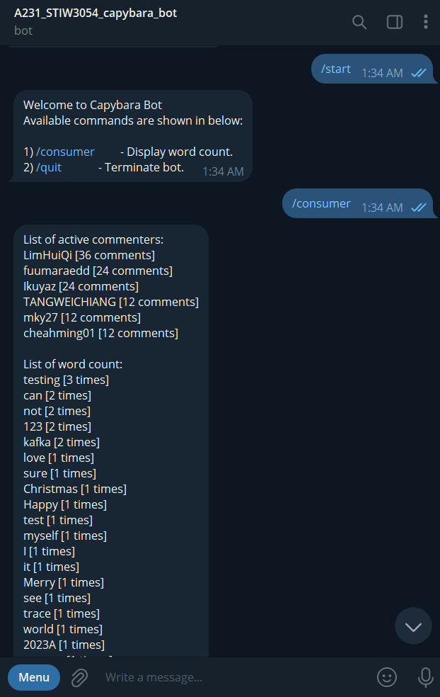  
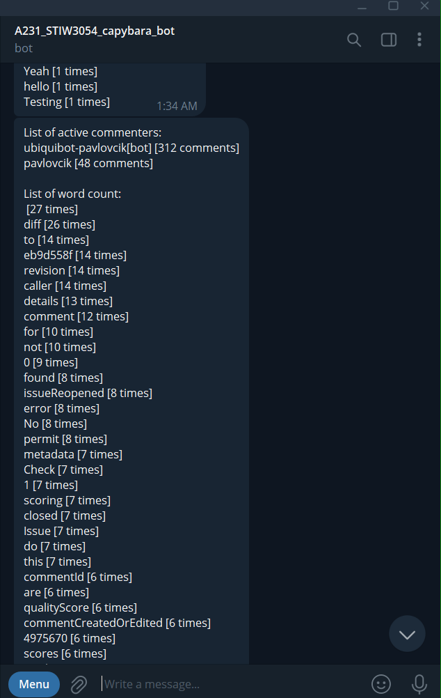  
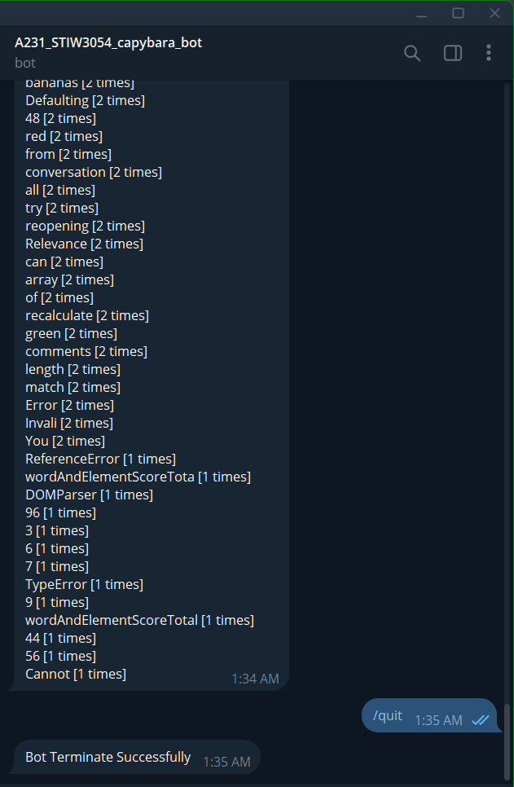

Intellij console output:  
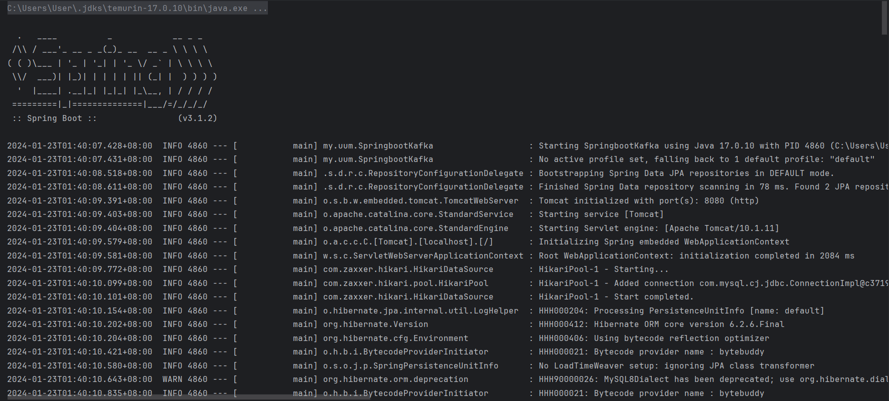  
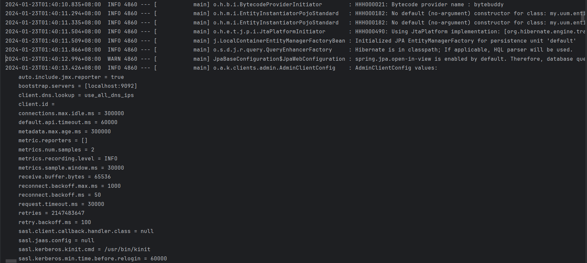  
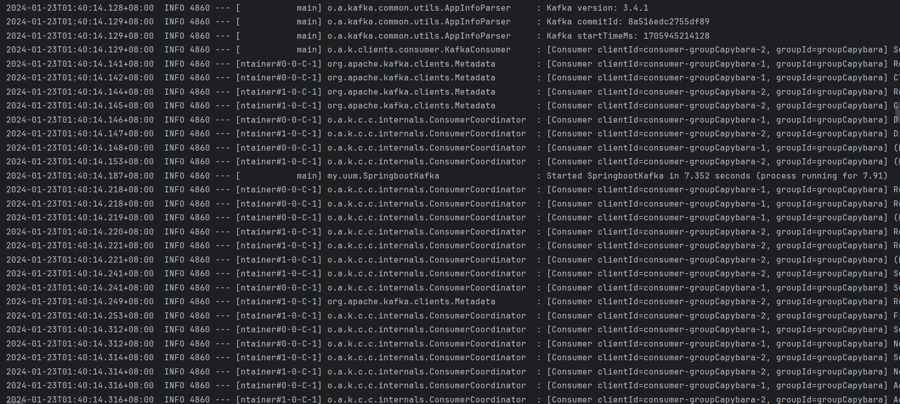  
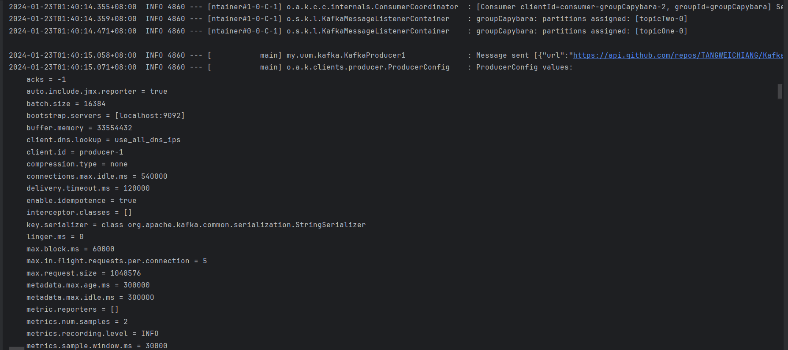  
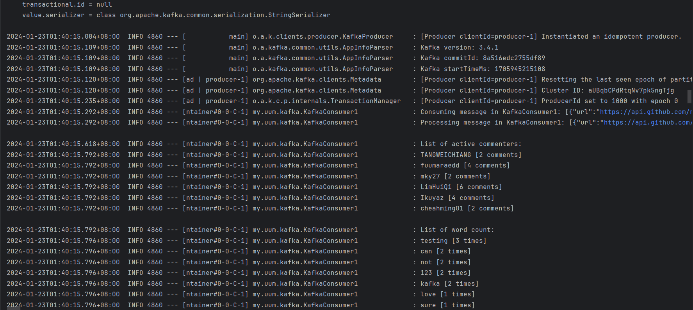  
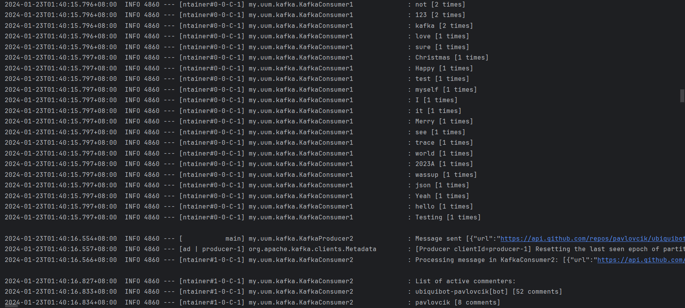  
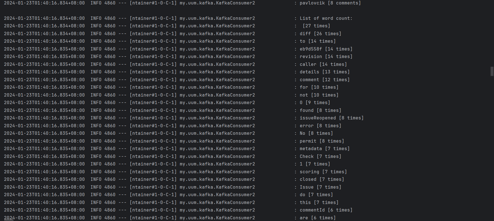  
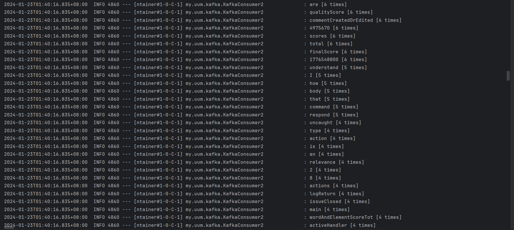  
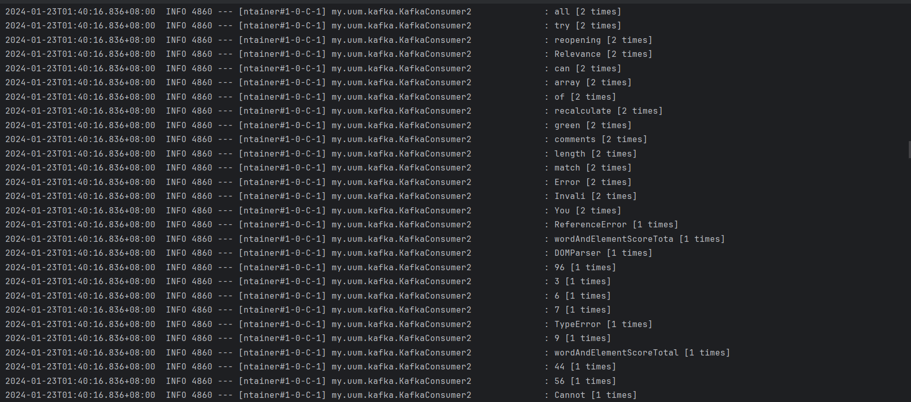

Docker container output/ cmd output:  
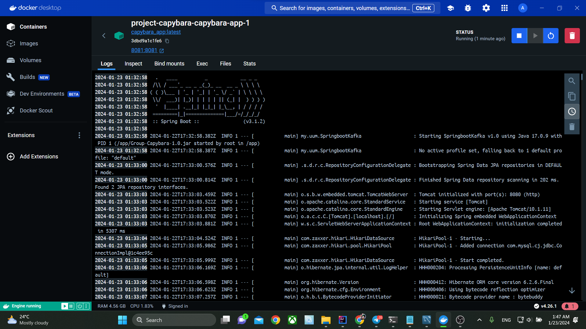  
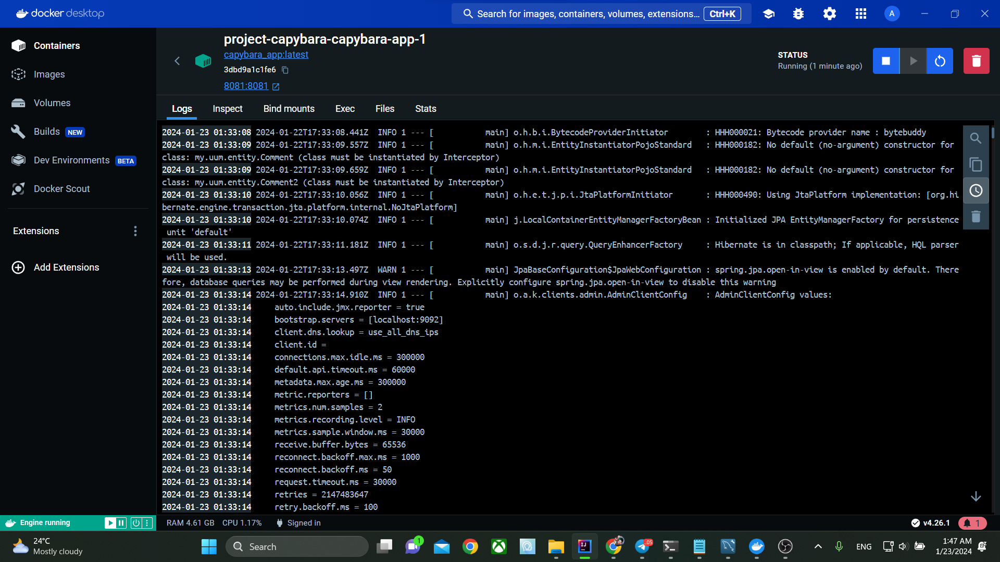  
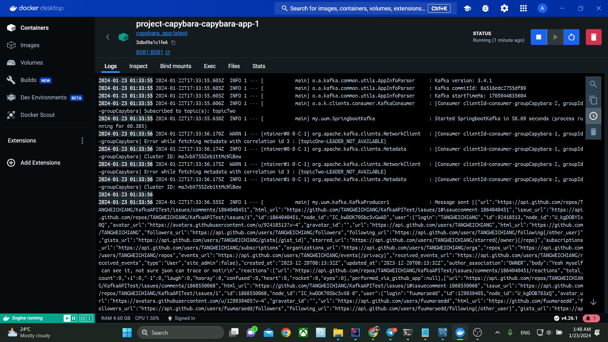  
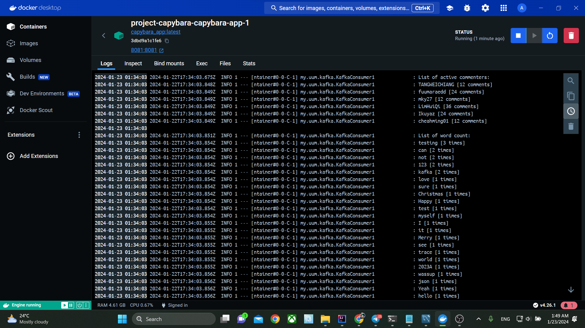  
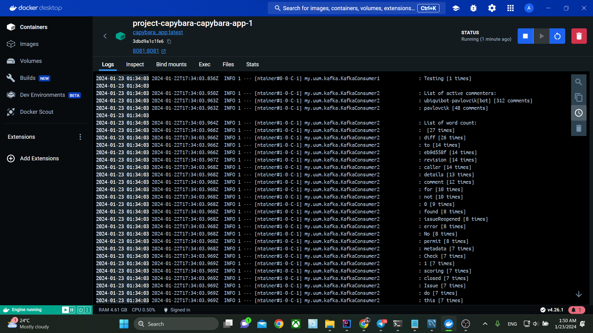

MySQL Database:  
comments:  
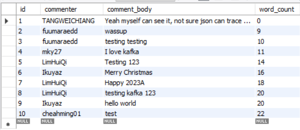  
comments2:  
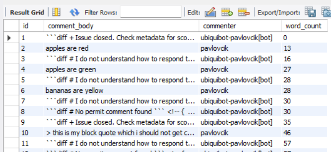

## References (Not less than 20)
1.	Build a real-time streaming ETL pipeline in 20 minutes. (n.d.). Confluent. https://www.confluent.io/blog/building-real-time-streaming-etl-pipeline-20-minutes/

2.	Chen, L. (2015). Continuous delivery: Huge benefits, but challenges too. IEEE Software, 32(2), 50–54. https://doi.org/10.1109/ms.2015.27

3.	How to use apache kafka for real-time data streaming? (n.d.). ProjectPro. https://www.projectpro.io/article/kafka-for-real-time-streaming/916

4.	Introducing kafka streams: Stream processing made simple | confluent. (n.d.). Confluent. https://www.confluent.io/blog/introducing-kafka-streams-stream-processing-made-simple/

5.	Jamshidi, P., Ghafari, M., Ahmad, A., & Pahl, C. (2013). A framework for classifying and comparing architecture-centric software evolution research. In 2013 17th european conference on software maintenance and reengineering (CSMR 2013). IEEE. https://doi.org/10.1109/csmr.2013.39

6.	Jamshidi, P., Pahl, C., Mendonca, N. C., Lewis, J., & Tilkov, S. (2018). Microservices: The journey so far and challenges ahead. IEEE Software, 35(3), 24–35. https://doi.org/10.1109/ms.2018.2141039

7.	Laukkanen, E., Paasivaara, M., & Arvonen, T. (2015). Stakeholder perceptions of the adoption of continuous integration -- A case study. In 2015 agile conference (AGILE). IEEE. https://doi.org/10.1109/agile.2015.15

8.	Learn spring boot tutorial - javatpoint. (n.d.). www.javatpoint.com. https://www.javatpoint.com/spring-boot-tutorial

9.	Leppanen, M., Makinen, S., Pagels, M., Eloranta, V.-P., Itkonen, J., Mantyla, M. V., & Mannisto, T. (2015). The highways and country roads to continuous deployment. IEEE Software, 32(2), 64–72. https://doi.org/10.1109/ms.2015.50

10.	Maarek, S. (2017, October 24). How to use Apache Kafka to transform a batch pipeline into a real-time one. Medium. https://medium.com/@stephane.maarek/how-to-use-apache-kafka-to-transform-a-batch-pipeline-into-a-real-time-one-831b48a6ad85

11.	Namiot, D., & Sneps-Sneppe, M. (2021). On the new architecture of location-based services. In 2021 29th conference of open innovations association (FRUCT). IEEE. https://doi.org/10.23919/fruct52173.2021.9435603

12.	Neely, S., & Stolt, S. (2013). Continuous delivery? Easy! Just change everything (well, maybe it is not that easy). In 2013 agile conference (AGILE). IEEE. https://doi.org/10.1109/agile.2013.17

13.	Pipelining with kafka connect and kafka streams | confluent documentation. (n.d.). Confluent Documentation | Confluent Documentation. https://docs.confluent.io/platform/current/tutorials/examples/connect-streams-pipeline/docs/

14.	Rahman, A., Mahdavi-Hezaveh, R., & Williams, L. (2019). A systematic mapping study of infrastructure as code research. Information and Software Technology, 108, 65–77. https://doi.org/10.1016/j.infsof.2018.12.004

15.	Sharma, T., Fragkoulis, M., & Spinellis, D. (2016). Does your configuration code smell? In ICSE '16: 38th international conference on software engineering. ACM. https://doi.org/10.1145/2901739.2901761

16.	Spring boot architecture - javatpoint. (n.d.). www.javatpoint.com. https://www.javatpoint.com/spring-boot-architecture

17.	Spring boot tutorial - learn spring boot. (n.d.). GeeksforGeeks. https://www.geeksforgeeks.org/spring-boot/

18.	Steinmacher, I., Treude, C., & Gerosa, M. A. (2019). Let me in: Guidelines for the successful onboarding of newcomers to open source projects. IEEE Software, 36(4), 41–49. https://doi.org/10.1109/ms.2018.110162131

19.	Taibi, D., Lenarduzzi, V., & Pahl, C. (2018). Architectural patterns for microservices: A systematic mapping study. In 8th international conference on cloud computing and services science. SCITEPRESS - Science and Technology Publications. https://doi.org/10.5220/0006798302210232

20.	Yoshida, E., Kazama, S., Kuwamura, S., Gokita, S., Miyoshi, T., Noguchi, Y., & Honda, Y. (2018). Memory expansion technology for large-scale data processing using software-controlled SSD. In 2018 IEEE Symposium on VLSI Circuits. IEEE. https://doi.org/10.1109/vlsic.2018.8502312

## Youtube Presentation (10%)
https://youtu.be/f5kA8GgzGIU - Video of Producer Application: 26 Dec 2023  
https://youtu.be/qVlOySKpPwQ - (Group Presentation) The implementation of the system: 23 Jan 2023
